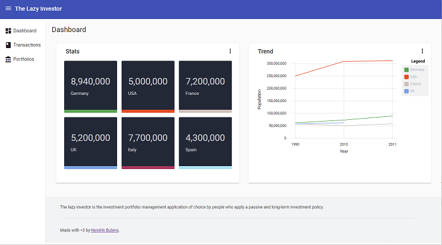

# The Lazy Investor

The lazy investor is an investment portfolio management application for the average Joe who intends to hold his assets for a long time.

## Getting Started

This application is split into two distinct areas. Unsurprisingly, there's a front-end and a back-end attached to the lazy investor.

To run the server, run the command `dotnet run` for the web project.
To run the client, execute the command `yarn start`.

### Prerequisites

The front-end application is a simple Angular application. We recommend to use **yarn** as the package manager.

The back-end system is a ASP.NET Core 3.x solution. It is recommended to have Visual Studio 2019 Community or higher.

## Running the tests

Run `dotnet test` for the server app and `yarn test` for the client app.

## Deployment

Run `dotnet publish` for the server app and `yarn build` for the client app

## Built With

* ASP.NET Core
* Angular 9

## Contributing

Pull requests are welcome. For major changes, please open an issue first to discuss what you would like to change. Please make sure to update the tests as appropriate.

## Versioning

We use [SemVer](http://semver.org/) for versioning. For the versions available, see the [tags on this repository](https://github.com/your/project/tags).

## License

This project is licensed under the MIT License - see the [LICENSE.md](LICENSE.md) file for details
