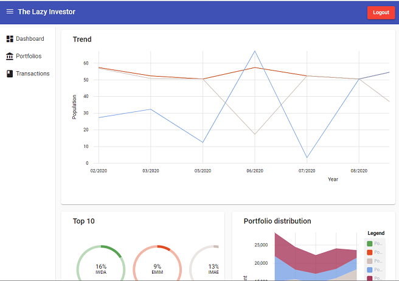
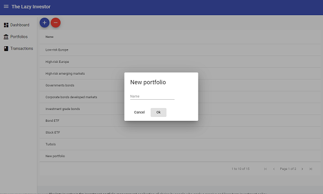
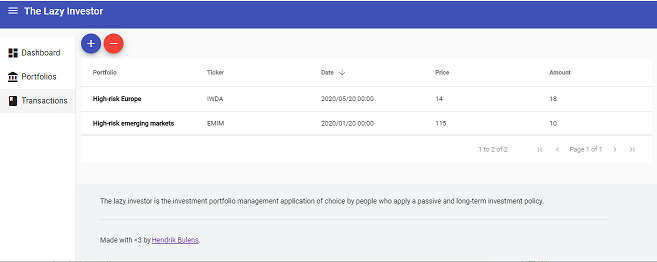

# The Lazy Investor


The lazy investor is an investment portfolio management application for the average Joe who intends to hold his assets for a long time.



The basic functions include the management of the portfolio and registering transactions.





Metrics are the major asset of this application. A comprehensive dashboard should give the lazy investor all he needs to know for the time being.

## Getting Started

This application is split into two distinct areas. Unsurprisingly, there's a front-end and a back-end attached to the lazy investor.

The front-end application is a simple Angular application. We recommend to use **yarn** as the package manager.

The back-end system is a ASP.NET Core 3.x solution. It is recommended to have Visual Studio 2019 Community or higher.

To run the server, run the command `dotnet run` for the web project.
To run the client, execute the command `yarn start`.

To connect the two applications, make sure the configuration is set correctly:

appsettings.json:
``` json
{     
  "AllowedOrigins": [
    "http://localhost:4200"
  ]
}
```

environment.xxx.ts:

```typescript
export const environment = {
  api:  {
    url: "https://localhost:44350"
  }
};
```

## Running the tests

Run `dotnet test` for the server app and `yarn test` for the client app.

## Deployment

Run `dotnet publish` for the server app and `yarn build` for the client app

## Built With

The client application is built with a standard Angular 9 app, supported by libraries such as Angular Material and ngrx.

The server application is built on top of the ASP.NET Core framework. It is primarily used to serve RESTful web services.
Entity Framework is used as the ORM to query and manipulate data in a PostgreSQL database. For this project, the mediator pattern is used to link web requests to the back-end services.

## Contributing

Pull requests are welcome. For major changes, please open an issue first to discuss what you would like to change. Please make sure to update the tests as appropriate.

## Versioning

We use [SemVer](http://semver.org/) for versioning. For the versions available, see the [tags on this repository](https://github.com/your/project/tags).

## License

This project is licensed under the MIT License - see the [LICENSE.md](LICENSE.md) file for details
